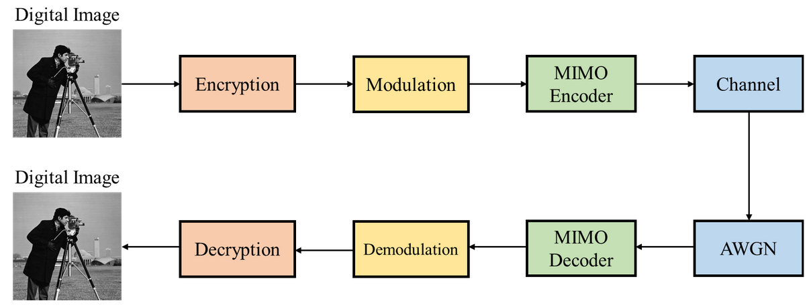

reless Communication System with Encryption

### Final Project Group 5

## Table of Content

- Wireless Communication System with Encryption
  - About The Project
  - Directory structure
  - [Usage](#Usage)

## About The Project

Implementation a end-to-end Wireless Communication System with Encryption with HLS

## Directory structure

* **PATTERN/**
  * Test Image Pattern
* **hls/**
  * HLS C++ source code
* **other/**
  * ...

## Usage 

* **Block Diagram**
  
* **Build the Project with Vitis_HLS**
  * `make run CSIM=1 CSYNTH=1 COSIM=1`
* **Running on U50**
  * Use Vitis OPENCL flow
  * Add the src & host program into the project, then build and run.

## Results

**With AES**

**Without AES**

## References

* https://github.com/WilliamsCeng/02Hero
* [AES加密算法的详细介绍与实现_TimeShatter的博客-CSDN博客_aes](https://blog.csdn.net/qq_28205153/article/details/55798628)
* [NetPBM Viewer (kylepaulsen.com)](https://www.kylepaulsen.com/stuff/NetpbmViewer/)
* [Vitis_Libraries/quantitative_finance/L1/tests/normalRNG at master · Xilinx/Vitis_Libraries (github.com)](https://github.com/Xilinx/Vitis_Libraries/tree/master/quantitative_finance/L1/tests/normalRNG)
